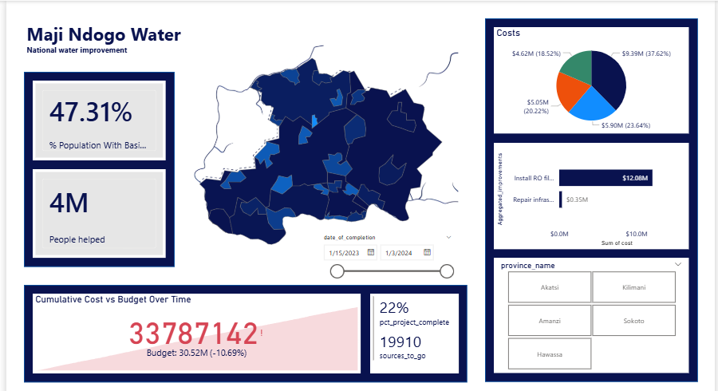

# Maji Ndogo Water — Part 4: Public Dashboard (Fund Transparency)

Fourth project in a multi-part Power BI series on Maji Ndogo's water access crisis. This one shifts from internal analysis to a **public-facing accountability dashboard**, built to satisfy a real stakeholder brief: show citizens and an international funder exactly where water infrastructure money is going, while giving decision-makers the operational detail to act on it.

## The Brief

The project sponsor requested a single dashboard that could serve two audiences at once:

**As a member of the public**, I want to see:
- How the project is going — which sources have been completed
- How much money has been spent, where, and on what
- Details specific to my own town

**As a decision-maker**, I want to see:
- Overall project progress and whether the budget will hold
- A cost breakdown by location and improvement type
- Where costs can potentially be cut
- All of the above at national, provincial, and town level

Rather than building two dashboards, the two user stories were merged into one, with room for drill-throughs where the decision-maker view needed more depth than the public view.

## Page 1: National Overview

- **47.31%** of the population now has basic water access, **4M** people helped so far
- **$33.79M** spent against a **$30.52M** budget — currently ~10.7% over
- **22% project complete**, ~19,910 water sources still to go
- Cost breakdown by province (pie chart) and by improvement type (RO filter installation vs. infrastructure repair)
- Province selector for drilling into town-level detail

## Key DAX Measures Built

The dataset didn't have pre-built fields for most of this — they had to be calculated as DAX measures so the numbers stay accurate under every filter combination (national, provincial, town, and date range) rather than being frozen calculated columns:

- **`total_improvements`** — total project count, filtered correctly by town using `ALLEXCEPT` so a province selection doesn't accidentally reset to the national total
- **`number_completed_projects`** / **`pct_project_complete`** — completion rate, calculated as completed ÷ total for whatever location filter is active
- **`total_population`** — population sum that respects the town filter while ignoring irrelevant ones
- **`population_with_basic_access`** — sums people served by sources meeting the "basic access" definition (clean wells, in-home taps, or shared taps with under-30-minute queue times), evaluated with `FILTER` + `ALL` so it recalculates correctly regardless of what's selected elsewhere
- **`population_now_basic_access`** / **`pct_population_now_basic_access`** — tracks the *impact* of the project itself: people who gained access specifically because of a completed improvement, separate from those who already had access
- **`cumulative_cost`** / **`cumulative_budget`** — running totals up to a selected date, feeding a KPI visual configured with "low is good" trend logic (since overspending should read as a warning, not a win) so a budget overrun displays correctly instead of showing a false "on target" indicator
- **`budgeted_improvement_cost`** — adjusted with `CONTAINSSTRING` logic to correctly match rural project costs after the underlying town-naming convention changed in a later data refresh, without breaking the existing report

## Why This Approach

Real project data is messy in ways that punish simple assumptions. Working through this brief surfaced a few findings worth calling out:
- Rural improvements cost roughly twice as much as urban ones — a budget factor, not a vendor problem
- The province driving the biggest overspend (Sokoto) isn't necessarily working with the most expensive vendors — once compared against teams working in similar rural/hard-to-reach conditions, the "expensive" vendors were actually the most cost-efficient per completed project
- Vendor cost has to be evaluated in context (terrain, source type, project count) rather than by sticker price alone, or the "obvious" cost-cutting move (dropping the priciest vendor) would have been the wrong call

## Tools
Power BI Desktop (data modeling, DAX, KPI visuals, shape maps, interactive filtering)

## Files
- `Public_Dashboard.pbix` — Power BI file

